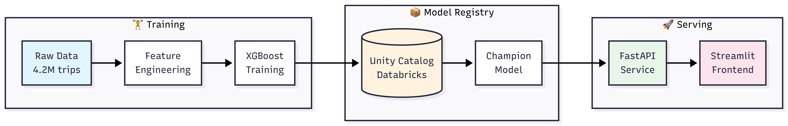
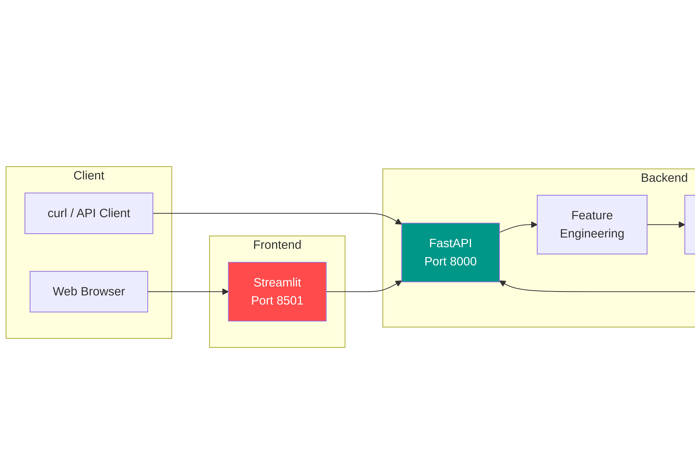
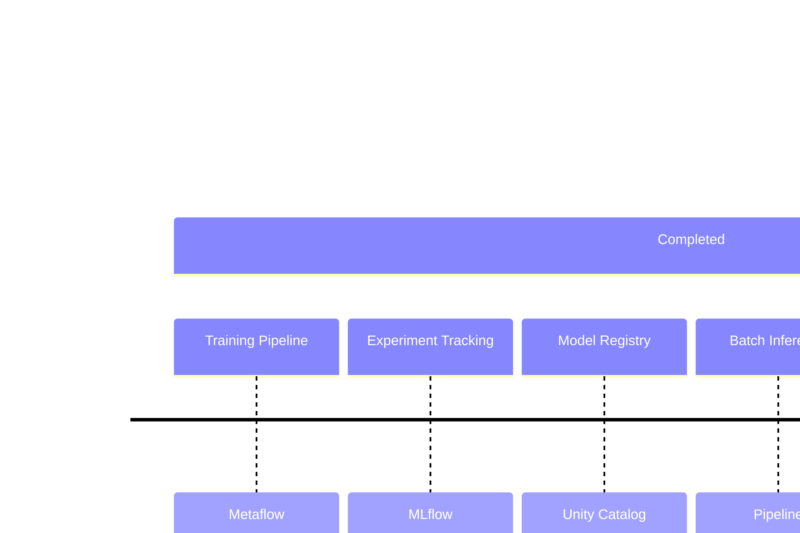

# 🚕 NYC Taxi Fare Prediction

**Production-grade ML pipeline for NYC taxi fare prediction using Metaflow, MLflow, and XGBoost. Features parallel cross-validation, experiment tracking, and automated model registration.**

[](https://www.python.org/downloads/)
[](https://metaflow.org/)
[](https://mlflow.org/)
[](https://fastapi.tiangolo.com/)
[](LICENSE)

---

## System Architecture



---

## Quick Start

**Train a model:**
```bash
python src/pipelines/training.py run
```

**Run inference on new data:**
```bash
python src/pipelines/inference.py run --input-data data/trips.parquet
```

**Serve predictions via API:**
```bash
# 1. Download model from Unity Catalog
python src/serving/download_model.py

# 2. Start API server
uvicorn src.serving.api:app --port 8000

# 3. Test it
curl -X POST http://localhost:8000/predict \
  -H "Content-Type: application/json" \
  -d '{"pickup_datetime": "2024-01-15 08:30:00", 
       "dropoff_datetime": "2024-01-15 09:15:00", 
       "trip_distance": 5.2}'
```

**Launch the UI:**
```bash
streamlit run src/serving/frontend.py
```

---

## What's Inside

This isn't a Jupyter notebook that "kind of works." It's a complete MLOps system with:

| Component | What it does | Tech |
|-----------|--------------|------|
| **Training Pipeline** | Loads data → engineers 30+ features → trains XGBoost → registers model | Metaflow |
| **Inference Pipeline** | Batch predictions on new data with drift monitoring | Metaflow |
| **Model Registry** | Versioned models with champion/challenger aliases | Unity Catalog |
| **Experiment Tracking** | Metrics, parameters, artifacts logged automatically | MLflow + Databricks |
| **REST API** | Sub-100ms predictions with health checks | FastAPI |
| **Web UI** | User-friendly fare estimator with tip calculator | Streamlit |

---

## Pipeline Details

### Training Pipeline


### Inference Pipeline


---

## Serving Architecture



---

## Project Structure

```
.
├── src/
│   ├── pipelines/
│   │   ├── training.py      # Full training pipeline (~550 lines)
│   │   └── inference.py     # Batch inference pipeline (~1100 lines)
│   ├── serving/
│   │   ├── api.py           # FastAPI prediction service
│   │   ├── frontend.py      # Streamlit UI
│   │   └── download_model.py # Cache model locally from Unity Catalog
│   └── common/
│       └── pipeline.py      # Shared decorators and utilities
├── config/
│   └── local.yml            # Environment configuration
├── data/                    # Parquet files (not in repo)
├── models/cache/            # Locally cached model artifacts
└── predictions/             # Inference outputs
```

---

## Feature Engineering

The model learns from **30+ engineered features** extracted from raw trip data:


---

## Model Performance

Trained on **4.2 million** NYC yellow taxi trips (September 2025):

| Metric | Value |
|--------|-------|
| **R² Score** | 0.87 |
| **RMSE** | $4.23 |
| **MAE** | $2.89 |
| **Training Time** | ~8 minutes |

---

## API Endpoints

| Endpoint | Method | Description |
|----------|--------|-------------|
| `/health` | GET | Liveness check for load balancers |
| `/model/info` | GET | Model version, type, and metadata |
| `/predict` | POST | Single trip fare prediction |

**Example Response:**
```json
{
  "predicted_fare": 25.50,
  "trip_duration_minutes": 45.0,
  "model_version": "1",
  "prediction_timestamp": "2024-01-15T10:30:00"
}
```

---

## Tech Stack


---

## Configuration

Set these environment variables (or use a `.env` file):

```bash
# Databricks / MLflow
DATABRICKS_HOST=https://your-workspace.cloud.databricks.com
DATABRICKS_TOKEN=dapi_xxxxxxxxxxxxx

# Optional
MODEL_CACHE_DIR=models/cache
API_URL=http://localhost:8000
```

---

## Installation

```bash
# Clone
git clone https://github.com/nilesh-auradkar05/NYC-Taxi-Fare-Prediction-ML-System.git
cd nyc-taxi-prediction

# Install dependencies
poetry install

# Or with pip
pip install -r requirements.txt
```

**Dependencies:**
- Python 3.12+
- XGBoost, scikit-learn, pandas, numpy
- Metaflow, MLflow
- FastAPI, uvicorn, streamlit
- loguru, python-dotenv

---

## Data

Download NYC TLC trip data from the [official source](https://www.nyc.gov/site/tlc/about/tlc-trip-record-data.page):

```bash
# Example: September 2025 Yellow Taxi data
wget https://d37ci6vzurychx.cloudfront.net/trip-data/yellow_tripdata_2025-09.parquet \
  -O data/yellow_tripdata_2025-09.parquet
```

---

## Roadmap



- [x] Training pipeline with Metaflow
- [x] MLflow experiment tracking
- [x] Unity Catalog model registry
- [x] Batch inference pipeline
- [x] FastAPI serving layer
- [x] Streamlit frontend
- [ ] Data versioning (DVC)
- [ ] ONNX model export
- [ ] Model monitoring & drift detection
- [ ] Docker containerization
- [ ] React/Next.js frontend
- [ ] Cloud deployment (AWS/GCP)

---

## Why This Project?

**This project serves as a reference architecture for production-grade ML systems, showcasing the integration of Metaflow with a comprehensive MLOps stack.**:

| Question | Answer |
|----------|--------|
| How do you version models? | Unity Catalog with champion/challenger aliases |
| How do you serve predictions? | FastAPI with sub-100ms latency |
| How do you track experiments? | MLflow logging every run automatically |
| How do you handle training-serving skew? | Same transformer, same features, everywhere |
| How do you deploy? | Docker + cloud deployment (coming soon) |

---

## Acknowledgments

- [ml.school](https://www.ml.school) curriculum for the project structure
- [NYC TLC](https://www.nyc.gov/site/tlc/about/tlc-trip-record-data.page) for the trip data
- [Databricks](https://databricks.com) for MLflow and Unity Catalog

---

<p align="center">
  <b>Built with ❤️ and too much ☕</b>
</p>
