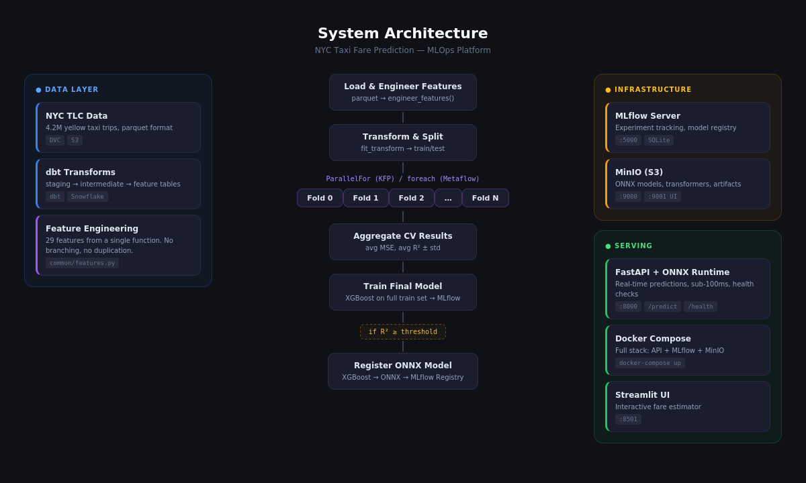
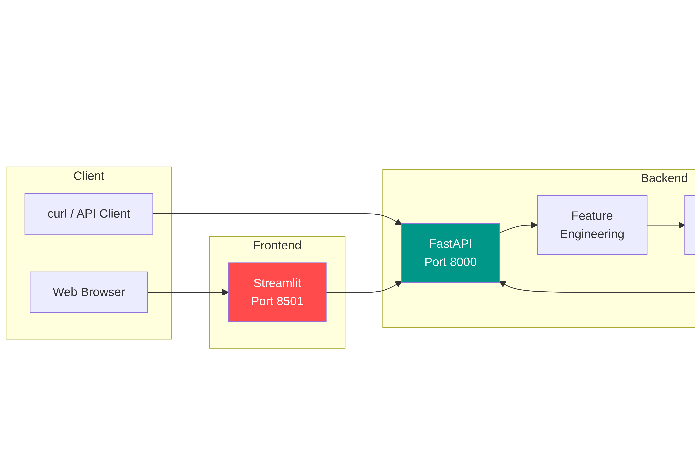
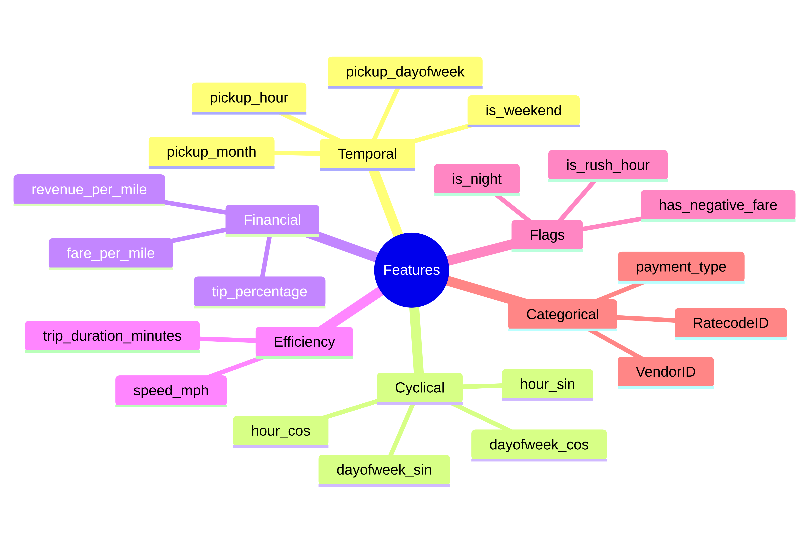
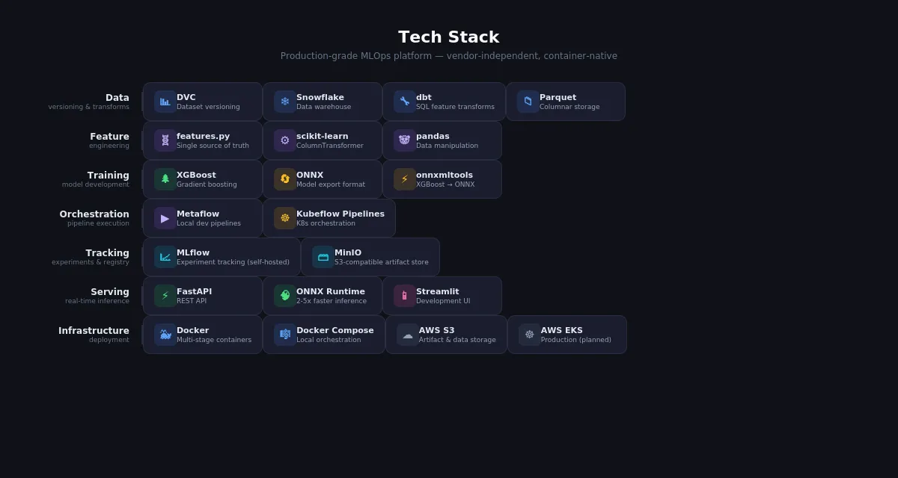
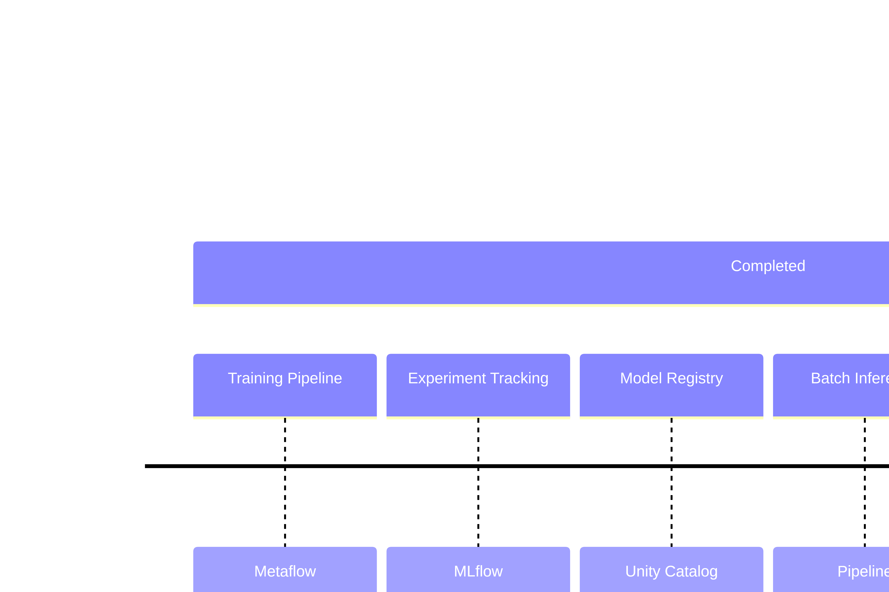

# 🚕 NYC Taxi Fare Prediction

**Production-grade ML system for NYC taxi fare prediction. ONNX Runtime inference, self-hosted MLflow, Docker Compose infrastructure, Kubeflow Pipelines orchestration, and a unified feature engineering module that eliminates training-serving skew.**

[](https://www.python.org/downloads/)
[](https://www.kubeflow.org/docs/components/pipelines/)
[](https://mlflow.org/)
[](https://onnxruntime.ai/)
[](https://fastapi.tiangolo.com/)
[](https://www.docker.com/)
[](LICENSE)

---

## System Architecture



---

## Quick Start

### Option A: Docker Compose (Recommended)

```bash
# 1. Clone and configure
git clone https://github.com/nilesh-auradkar05/NYC-Taxi-Fare-Prediction-ML-System.git
cd NYC-Taxi-Fare-Prediction-ML-System
git checkout nyc-taxi-prediction-v2
cp .env.example .env

# 2. Start infrastructure (MLflow + MinIO)
docker-compose up mlflow minio minio-setup -d

# 3. Train a model (registers ONNX model to MLflow)
python src/pipelines/training.py run

# 4. Download model artifacts to local cache
python src/serving/download_model.py

# 5. Start the full stack (adds API service)
docker-compose up -d

# 6. Test prediction
curl -X POST http://localhost:8000/predict \
  -H "Content-Type: application/json" \
  -d '{"pickup_datetime": "2025-01-15 08:30:00",
       "trip_distance": 5.2,
       "passenger_count": 2}'
```

**Services:**

| Service | URL | Purpose |
|---------|-----|---------|
| **API** | http://localhost:8000 | Fare predictions (Swagger at `/docs`) |
| **Prometheus Metrics** | http://localhost:8000/metrics | Scrape target for monitoring |
| **MLflow** | http://localhost:5000 | Experiment tracking UI |
| **MinIO** | http://localhost:9001 | S3 artifact storage console |

### Option B: Local (Without Docker)

```bash
# Install dependencies
poetry install  # or: pip install -r requirements.txt

# Train
python src/pipelines/training.py run

# Serve
python src/serving/download_model.py
uvicorn src.serving.api:app --port 8000
```

### Option C: Kubeflow Pipelines

```bash
# Build the training image
docker build -f Dockerfile.training -t nyc-taxi-training .

# Compile pipeline to YAML
python src/pipelines/kfp_pipeline.py --output pipeline.yaml

# Submit to a running Kubeflow cluster
python src/pipelines/kfp_pipeline.py --submit --host http://kubeflow.local
```

**Launch the UI:**
```bash
streamlit run src/serving/frontend.py
```

---

## What's Inside

This isn't a Jupyter notebook that "kind of works." It's a complete MLOps system with:

| Component | What it does | Status |
|-----------|-------------|--------|
| **Training Pipeline** | Time-based split, fold-local CV, XGBoost, ONNX export, MLflow registry | **Implemented** |
| **Inference Pipeline** | Batch predictions on new data via ONNX Runtime | **Implemented** |
| **Feature Engineering** | Single source of truth — same function in training, inference, and serving | **Implemented** |
| **REST API** | Pre-trip fare estimator with ONNX Runtime inference | **Implemented** |
| **Monitoring** | Prometheus metrics, prediction tracking, Evidently drift detection | **Implemented** |
| **Model Registry** | Versioned ONNX models with experiment lineage | **Implemented** |
| **Infrastructure** | MLflow + MinIO + API in one command | **Implemented** |
| **Web UI** | Streamlit fare estimator | **Implemented** |
| **KFP Pipeline** | Kubeflow Pipelines v2 DAG with parallel CV | **Experimental** |
| **Cloud Deployment** | AWS EKS | **Pending** |
| **Feature Store** | Feast online/offline serving | **Pending** |


---

## API Endpoints

| Endpoint | Method | Description |
|----------|--------|-------------|
| `/predict` | POST | Pre-trip fare prediction |
| `/health` | GET | Health check for load balancers |
| `/ready` | GET | Kubernetes readiness probe |
| `/live` | GET | Kubernetes liveness probe |
| `/model/info` | GET | Model version and metadata |
| `/metrics` | GET | Prometheus metrics (latency, counts, distributions) |
| `/predictions/summary` | GET | Recent prediction statistics |
| `/drift` | POST | Evidently drift detection on recent predictions |

**Example Request (pre-trip — no dropoff time or fare required):**
```json
{
  "pickup_datetime": "2025-01-15 08:30:00",
  "trip_distance": 5.2,
  "passenger_count": 2,
  "estimated_duration_minutes": 25.0
}
```

**Example Response:**
```json
{
  "predicted_fare": 22.50,
  "estimated_duration_minutes": 25.0,
  "model_version": "1",
  "prediction_timestamp": "2025-01-15T10:30:00Z"
}

---

## Key Engineering Decisions

### Data Leakage Fix
The original pipeline had features that used `total_amount` (the prediction target) during computation, inflating metrics. Fixed by deriving from `fare_amount` instead and removing redundant features. Cross-validation now uses fold-local preprocessing — each fold fits its own transformer, preventing statistics from leaking across the train/validation boundary.

### Time-Based Evaluation
Training uses chronological split (first 80% by pickup time, last 20% for testing) instead of random split. This reflects real-world usage where you predict future trips from historical data.

### Pre-Trip Estimator Contract
The API only requires information available *before* a trip: pickup time, estimated distance, and optional metadata. It does not ask for dropoff time, fare amount, or tip — because no one has that information before the ride starts.

### Unified Feature Module
`src/common/features.py` is the single source of truth for all feature engineering. Training, batch inference, and the REST API all call the same `engineer_features()` function. No parameter toggles, no code branching.

### Self-Hosted MLflow
MLflow runs on your infrastructure with MinIO for S3-compatible artifact storage. No vendor lock-in, full experiment tracking, works identically in local dev and production.

### ONNX Runtime Serving
XGBoost trains normally, converts to ONNX before registration. Serving loads `.onnx` directly — no XGBoost dependency at inference time. Smaller image, faster cold starts.

---

## Pipeline Details

---

### Training Pipeline


The training pipeline runs in two flavors that share the same `common/features.py` module and produce the same ONNX model format:

**Local Python runner** — `python src/pipelines/training.py run` — single-process execution with fold-local cross-validation. Good for local development and iteration.

**Kubeflow Pipelines** — `python src/pipelines/kfp_pipeline.py` — each step runs in its own container via `dsl.ParallelFor`. Registration is gated by `dsl.Condition` on the R² threshold. Production-ready on Kubernetes.

### Inference Pipeline


---

## Serving Architecture



The serving layer loads two artifacts: `model.onnx` (ONNX Runtime) and `transformer.joblib` (sklearn ColumnTransformer). Feature engineering uses the same `engineer_features()` function from `common/features.py` — no duplication, no branching, no training-serving skew.

---

## Monitoring

The API tracks every prediction with Prometheus metrics:

- **Request count** by status (success/error)
- **Latency histogram** (p50, p95, p99)
- **Prediction value distribution** (fare amounts)
- **Distance distribution** (trip distances)

A 5,000-record ring buffer stores recent predictions for drift analysis. The `/drift` endpoint runs Evidently's `DataDriftPreset` comparing recent predictions against a reference distribution, flagging shifts in fare, distance, time-of-day, and other features.

---

## Project Structure

```
.
├── Dockerfile                    # Multi-stage serving image (FastAPI + ONNX Runtime)
├── Dockerfile.training           # Base image for KFP pipeline components
├── docker-compose.yml            # Full stack: MLflow + MinIO + API
├── docker-compose.mlflow.yml     # MLflow + MinIO only
├── requirements-serving.txt      # Minimal API dependencies
├── requirements-training.txt     # Training + KFP dependencies
├── .env.example                  # Environment variable template
├── .dockerignore
│
├── src/
│   ├── common/
│   │   ├── features.py           # Single source of truth for feature engineering
│   │   └── pipeline.py           # Shared local runner helpers
│   │
│   ├── pipelines/
│   │   ├── kfp_components.py     # KFP v2 container components (6 steps)
│   │   ├── kfp_pipeline.py       # KFP pipeline DAG + compiler/submitter
│   │   ├── training.py           # Local training runner
│   │   └── inference.py          # Local batch inference runner (ONNX Runtime)
│   │
│   └── serving/
│       ├── api.py                # FastAPI prediction service (ONNX Runtime)
│       ├── download_model.py     # Pull model from MLflow to local cache
│       └── frontend.py           # Streamlit UI
│
├── dbt_nyc_taxi/                 # dbt models (Snowflake feature transforms)
│   ├── models/
│   │   ├── staging/              # Raw data cleaning
│   │   ├── intermediate/         # Business logic
│   │   └── features/             # ML-ready feature tables
│   └── dbt_project.yml
│
├── config/
│   └── local.yml                 # Environment configuration
├── Dataset/                      # Parquet files (DVC-tracked, not in repo)
├── models/cache/                 # Locally cached model artifacts
└── predictions/                  # Inference outputs
```

---

## Feature Engineering

The model learns from **29 engineered features** extracted from raw trip data:



All feature logic lives in a single function — `engineer_features()` in `src/common/features.py`. Training, inference, and the API all import this same function with no arguments that change behavior. This eliminates the most common source of silent prediction drift in production ML systems.

**Data Leakage Fix:** Three features in the original pipeline used `total_amount` (the prediction target) during computation, inflating metrics and causing training-serving skew:

| Feature | Before (Leaking) | After (Fixed) |
|---------|-------------------|---------------|
| `revenue_per_mile` | `total_amount / trip_distance` | **Removed** — redundant with `fare_per_mile` |
| `tip_percentage` | `tip_amount / total_amount` | `tip_amount / fare_amount` |
| `has_negative_fare` | `total_amount < 0` | `fare_amount < 0` |

---

## Model Performance

Trained on **4.2 million** NYC yellow taxi trips (September 2025):

| Metric | Value |
|--------|-------|
| **R² Score** | 0.87 |
| **RMSE** | $4.23 |
| **MAE** | $2.89 |
| **Training Time** | ~8 minutes |

> **Note:** These metrics were recorded before the data leakage fix. Post-fix R² is expected to be lower — that drop reflects honest evaluation. The previous metrics were inflated by features derived from the target variable.

---

---

## Tests

```bash
python -m pytest tests/ -v
```

---

## Tech Stack



| Layer | Tool | Purpose |
|-------|------|---------|
| **Training** | XGBoost, scikit-learn | Model training with cross-validation |
| **Orchestration** | Local Python runners, Kubeflow Pipelines v2 | Pipeline execution (local and K8s) |
| **Model Format** | ONNX | Framework-agnostic, 2-5x faster inference |
| **Experiment Tracking** | MLflow (self-hosted) | Metrics, parameters, model registry |
| **Artifact Storage** | MinIO / AWS S3 | ONNX models, transformers, datasets |
| **Serving** | FastAPI, ONNX Runtime | Real-time predictions |
| **Containerization** | Docker, Docker Compose | Reproducible environments |
| **Data Versioning** | DVC + S3 | Git-like versioning for datasets |
| **Feature Transforms** | dbt + Snowflake | SQL-based feature pipelines |
| **Frontend** | Streamlit | Development UI |

---

## Configuration

Set these environment variables (or use `.env.example` as a template):

```bash
# MLflow (self-hosted)
MLFLOW_TRACKING_URI=http://127.0.0.1:5000
MLFLOW_EXPERIMENT_NAME=nyc-taxi-experiment

# S3 / MinIO (for MLflow artifact storage)
AWS_ACCESS_KEY_ID=minioadmin
AWS_SECRET_ACCESS_KEY=minioadmin
MLFLOW_S3_ENDPOINT_URL=http://localhost:9000   # MinIO only; omit for real S3

# Model cache (for serving)
MODEL_CACHE_DIR=models/cache
```

---

## Installation

```bash
# Clone
git clone https://github.com/nilesh-auradkar05/NYC-Taxi-Fare-Prediction-ML-System.git
cd NYC-Taxi-Fare-Prediction-ML-System

# Install dependencies
poetry install

# Or with pip
pip install -r requirements.txt
```

**Core Dependencies:**
- Python 3.11+
- XGBoost, scikit-learn, pandas, numpy
- ONNX Runtime, onnxmltools
- MLflow
- FastAPI, uvicorn, streamlit
- kfp (for Kubeflow Pipelines)
- loguru, python-dotenv

---

## Data

Download NYC TLC trip data from the [official source](https://www.nyc.gov/site/tlc/about/tlc-trip-record-data.page):

```bash
# Example: September 2025 Yellow Taxi data
wget https://d37ci6vzurychx.cloudfront.net/trip-data/yellow_tripdata_2025-09.parquet \
  -O Dataset/yellow_tripdata_2025-09.parquet
```

---

## Roadmap



- [x] Training pipeline with local Python runner
- [x] MLflow experiment tracking
- [x] FastAPI serving layer
- [x] Streamlit frontend
- [x] Batch inference pipeline
- [x] Unified feature engineering (data leakage fix)
- [x] ONNX model export + ONNX Runtime inference
- [x] Self-hosted MLflow (replaced Databricks/Unity Catalog)
- [x] Docker containerization (multi-stage builds)
- [x] Kubeflow Pipelines v2 (container components)
- [x] Data versioning (DVC + S3)
- [x] dbt + Snowflake feature transforms
- [x] Model monitoring & drift detection (Evidently, Prometheus, Grafana)
- [ ] React/Next.js frontend
- [ ] Cloud deployment (AWS EKS)

---

## Why This Project?

**A reference architecture for production-grade ML systems, demonstrating how the pieces of a real MLOps platform fit together:**

| Question | Answer |
|----------|--------|
| How do you version models? | Self-hosted MLflow Model Registry with ONNX artifacts in S3 |
| How do you serve predictions? | FastAPI + ONNX Runtime with sub-100ms latency |
| How do you track experiments? | MLflow logging every run automatically |
| How do you handle training-serving skew? | Single `engineer_features()` function — same code everywhere |
| How do you orchestrate? | Local Python runner (local dev) + Kubeflow Pipelines (Kubernetes) |
| How do you deploy? | Docker Compose (local) → AWS EKS (production) |

---

## Acknowledgments

- [ml.school](https://www.ml.school) curriculum for the project structure
- [NYC TLC](https://www.nyc.gov/site/tlc/about/tlc-trip-record-data.page) for the trip data
- [MLflow](https://mlflow.org/) for experiment tracking and model registry
- [Kubeflow](https://www.kubeflow.org/) for pipeline orchestration on Kubernetes

---
